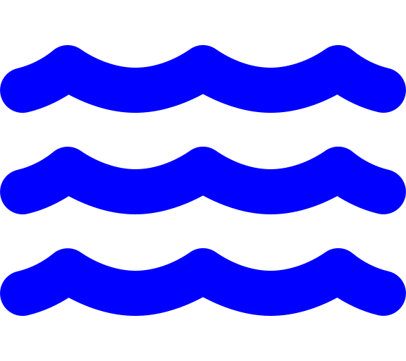

<a id="readme-top"></a>
# ASOC UON


<!-- TABLE OF CONTENTS -->
<details>
  <summary><h2>📚 Table of Contents</h2></summary>
  <ol>
    <li>
      <a href="#about-the-project">About The Project</a>
      <ul>
        <li><a href="#project-structure">Project Structure</a></li>
      </ul>
    </li>
    <li>
      <a href="#viewing-maps">Viewing Maps</a>
      <ul>
        <li><a href="#example-maps">Example Maps</a></li>
        <li><a href="#how-to-use">How To Use</a></li>
      </ul>
    </li>
    <li><a href="#features">Features</a></li>
    <li>
      <a href="#requirements">Requirements</a>
      <ul> 
        <li><a href="#installing-libraries">Installing Libraries</a></li>
      </ul>
    </li>
    <li>
      <a href="#setup">Setup</a>
      <ul>
        <li><a href="#google-sheet-structure">Google Sheet Structure</a></li>
        <li><a href="#example-google-sheet">Example Google Sheet</a></li>
        <li><a href="#map-icon-symbols">Map Icon Symbols</a></li>
      </ul>
    </li>
    <li>
      <a href="#usage">Usage</a>
      <ul>
        <li><a href="#updating-sabbath-walks-map">Updating Sabbath Walks Map</a></li>
        <li><a href="#creating-route-map">Creating Route Map</a></li>
        <li><a href="#updating-letterbox-map">Updating Letterbox Map</a></li>
      </ul>
    </li>
    <li><a href="#roadmap">Roadmap</a></li>
    <li><a href="#contributing">Contributing To The Maps</a></li>
    <li><a href="#license">License</a></li>
    <li><a href="#contact">Contact</a></li>
    <li><a href="#acknowledgments">Acknowledgments</a></li>
  </ol>
</details>

    


<!-- About the Project -->
## About The Project
This project provides Python scripts to create interactive HTML maps, which can be viewed in any web browser.
Specifically, maps are created for ASOC church locations/routes, Sabbath walks and letterboxing.

<details>
  <summary><h3><a name="project-structure">📚 Project Structure</a></h3></summary>
  <ul>
    <li>
      <strong>Docs</strong>: Contains all the documentation for project.
      <ul>
        <li><em><a href="docs/website">Website Folder</a></em>Small webpage wrapper.</li>
        <li><em><a href="docs/Letterbox_Documentation.md">Letterbox_Documentation.md</a></em>Documents the letterbox code.</li>
        <li><em><a href ="docs/Using_GPX_Studio.md">Using_GPX_Studio.md</a></em> Details how GPX Studio can be used to create gpx files.
        </li>
      </ul>
    </li>
    <li>
      <strong>gpx</strong>: Contains all GPX files
      <ul>
        <li><em><a href="gpx/Church_Locations/">Church_Locations</a></em>: Contains GPX files for Church Locations.</li>
        <li><em><a href="gpx/Letterbox_Routes/">Letterbox_Routes</a></em>: Contains GPX files of completed Letterbox routes.</li>
        <li><em><a href="gpx/Misc/">Misc</a></em>: Contains any other GPX files.</li>
        <li><em><a href="GPX_Files/Sabbath_Walks">Sabbath_Walks</a></em>: Contains GPX files for Sabbath walks.</li>
      </ul>
    </li>
    <li>
      <strong>src</strong>: Contains the code for generating maps.
      <ul>
        <li><em><a href="src/Create_Routes/">Create_Routes</a></em>: Creates a route.</li>
        <li><em><a href=src/Letterbox/">Letterbox</a></em>: Creates the letterbox maps.</li>
        <li><em><a href="src/Misc/">Misc</a></em>: Other codes.</li>
        <li><em><a href="src/Route_Code/">Route_Code</a></em></li>
        <li><em><a href="src/README.md/">README.md</a></em></li>
        <li><em><a href="src/Update_Walks.py/">Update_Walks.py</a></em>: Updates the map of ASOC walks.</li>
      </ul>
    </li>
    <li>
      <strong>maps</strong>: Contains the HTML files for the maps.
      <ul>
        <li><em><a href="maps/Church_Locations/">Church_Locations</a></em>: Contains maps for church and caregroup locations.</li>
        <li><em><a href="maps/Letterbox/">Letterbox</a></em>: Contains maps used for letterboxing.</li>
        <li><em><a href="maps/Misc/">Misc</a></em>: Other maps.</li>
        <li><em><a href="maps/Sabbath_Walks/">Sabbath_Walks</a></em>: Contains maps for Sabbath walks.</li>
      </ul>
    </li>
    <li>
      <strong>Images</strong>: Contains all images used in this repo.
      <ul>
        <li><em><a href="res/Icons/">Icons</a></em>: Contains Font Awesome Icons.</li>
        <li><em><a href="res/UML_Diagrams"/>UML_Diagrams</a></em>: Contails UML diagrams for code.
      </ul>
    </li>
    <li><em><a href="ASOC_Walks.ipynb">ASOC_Walks.ipynb</a></em>: Jupyter notebook for code testing.</li>
    <li><em><a href="CHANGELOG.md">CHANGELOG.md</a></em>: Records changes between versions.</li>
    <li><em><a href="LICENSE">LICENSE</a></em>: Explains the licensing of this project.</li>
    <li><em><a href="README.md">README.md</a></em>: Explains this project.</li>
  </ul>
</details>
  


<p align="right">(<a href="#readme-top">back to top</a>)</p>


## Viewing Maps
The maps can be viewed through GitHub Pages. You can access them using the following link format:
https://nuac-av.github.io/ASOC-UON/`file-name`.html

Replace `file-name` with the specific file you want to view. 
Note: replace spaces(" ") with "%20". 

### Example Maps

Here are some example usages of the maps:

1. **Main ASOC Walk Locations Map**:
   - **Description**: This map shows the main locations for the ASOC walks.
   - **Link**: https://nuac-av.github.io/ASOC-UON/Maps/Misc/ASOC_walk_locations_map.html

2. **Letterbox Map**:
   - **Description**: This map shows the letterbox regions and completed streets.
   - **Link**:  https://nuac-av.github.io/ASOC-UON/Maps/Letterbox/main.html


### How To Use

1. **Accessing the Map**:
   - Open your web browser.
   - Type the URL or click on the provided link for the specific map you want to view.

2. **Interacting with the Map**:
   - *Zoom In/Out*: Use the zoom controls to focus on specific areas.
   - *Pan*: Click and drag to move around the map.
   - *Markers*: Click on markers to get more information about each location.
   - *Filter*: Click on layer symbol in top right corner, allowing you to toggle on or off the different coloured icons.


<details>
  <summary><h3><a name="other-maps"> 🗺️ Other Maps</a></h3></summary>
  <ul>
    <li>Church_Locations
      <ul>
        <li><a href="https://nuac-av.github.io/ASOC-UON/Maps/Church_Locations/ES_Building.html">ES_Building.html</a></li>
        <li><a href="https://nuac-av.github.io/ASOC-UON/Maps/Church_Locations/Library_Church.html">Library_Church.html</a></li>
        <li><a href="https://nuac-av.github.io/ASOC-UON/Maps/Church_Locations/Library_Test.html">Library_Test.html</a></li>
      </ul>
    </li>
    <li>Letterbox
      <ul>
        <li><a href="https://nuac-av.github.io/ASOC-UON/Maps/Letterbox/letterbox_test_1.html">letterbox_test_1.html</a></li>
        <li><a href="https://nuac-av.github.io/ASOC-UON/Maps/Letterbox/letterbox_test_2.html">letterbox_test_2.html</a></li>
        <li><a href="https://nuac-av.github.io/ASOC-UON/Maps/Letterbox/letterbox_test_3.html">letterbox_test_3.html</a></li>
        <li>&#8942;</li>
        <li><a href="https://nuac-av.github.io/ASOC-UON/Maps/Letterbox/letterbox_test_23.html">letterbox_test_23.html</a></li>
      </ul>
    </li>
    <li>Misc
      <ul>
        <li><a href="https://nuac-av.github.io/ASOC-UON/Maps/Misc/ASOC_walk_locations_map.html">ASOC_walk_locations_map.html</a></li>
        <li><a href="https://nuac-av.github.io/ASOC-UON/Maps/Misc/routes_map.html">routes_map.html</a></li>
      </ul>
    </li>
    <li>Sabbath_Walks
      <ul>
        <li><a href="https://nuac-av.github.io/ASOC-UON/Maps/Sabbath_Walks/Hickson_Street_Lookout.html">Hickson_Street_Lookout.html</a></li>
        <li><a href="https://nuac-av.github.io/ASOC-UON/Maps/Sabbath_Walks/Islington_Park.html">Islington_Park.html</a></li>
        <li><a href="https://nuac-av.github.io/ASOC-UON/Maps/Sabbath_Walks/Mount_Sugarloaf.html">Mount_Sugarloaf.html</a></li>
      </ul>
    </li>
  </ul>
</details>

<p align="right">(<a href="#readme-top">back to top</a>)</p>


## Features
- Creates Interactive Sabbath Walk Maps:
  - Using the following sheet as a backend: [Google Sheets Document](https://docs.google.com/spreadsheets/d/1mGR_xugxcg3Pc3e1KLzggZn6XfnSJOuHncZ64hOo8M4/edit?fbclid=IwZXh0bgNhZW0CMTAAAR3rcnaz2qedGxf1LaI0fz7X7gUQiZrvZTjs3x-MfPTNZODKO8ykz3piWDI_aem_mtzQRofiQxsPinF7C6uSHg&gid=0#gid=0)
  - Reads data from the google sheets.
  - Plots 
- Create an interactive map from the database
- Add markers for each location with popups containing relevant information
- Save the map as an HTML file
- Add GPX routes from a folder and group them on the same level as regions in the tree structure

<p align="right">(<a href="#readme-top">back to top</a>)</p>


## Requirements
The requirements are contained in the [requirements.txt](requirements.txt) file.

### Required Libraries
- Python 3.x

<details>
  <summary>📚 Libraries</summary>
  <div style="display: flex; gap: 40px;">
    <table>
      <tr><th>Library</th><th>Version</th></tr>
      <tr><td>branca</td><td>0.7.2</td></tr>
      <tr><td>charset-normalizer</td><td>3.3.2</td></tr>
      <tr><td>cycler</td><td>0.12.1</td></tr>
      <tr><td>fonttools</td><td>4.53.1</td></tr>
      <tr><td>gpxpy</td><td>1.6.2</td></tr>
      <tr><td>Jinja2</td><td>3.1.4</td></tr>
      <tr><td>MarkupSafe</td><td>2.1.5</td></tr>
      <tr><td>networkx</td><td>3.3</td></tr>
      <tr><td>osmnx</td><td>1.9.3</td></tr>
      <tr><td>pandas</td><td>2.2.2</td></tr>
      <tr><td>pillow</td><td>10.4.0</td></tr>
      <tr><td>pyparsing</td><td>3.1.2</td></tr>
      <tr><td>python-dateutil</td><td>2.9.0.post0</td></tr>
      <tr><td>requests</td><td>2.32.3</td></tr>
      <tr><td>six</td><td>1.16.0</td></tr>
      <tr><td>urllib3</td><td>2.2.2</td></tr>
      <tr><td>xyzservices</td><td>2024.6.0</td></tr>
    </table>

    <table>
      <tr><th>Library</th><th>Version</th></tr>
      <tr><td>certifi</td><td>2024.7.4</td></tr>
      <tr><td>contourpy</td><td>1.2.1</td></tr>
      <tr><td>folium</td><td>0.17.0</td></tr>
      <tr><td>geopandas</td><td>1.0.1</td></tr>
      <tr><td>idna</td><td>3.7</td></tr>
      <tr><td>kiwisolver</td><td>1.4.5</td></tr>
      <tr><td>matplotlib</td><td>3.9.2</td></tr>
      <tr><td>numpy</td><td>2.0.0</td></tr>
      <tr><td>packaging</td><td>24.1</td></tr>
      <tr><td>pathlib</td><td>1.0.1</td></tr>
      <tr><td>pyogrio</td><td>0.9.0</td></tr>
      <tr><td>pyproj</td><td>3.6.1</td></tr>
      <tr><td>pytz</td><td>2024.1</td></tr>
      <tr><td>shapely</td><td>2.0.5</td></tr>
      <tr><td>tzdata</td><td>2024.1</td></tr>
      <tr><td>uuid</td><td>1.30</td></tr>
    </table>
  </div>
</details>

> **⚠️ Disclaimer:** Please ensure to use the specific package versions listed in the `requirements.txt` file. This guarantees that the program runs as expected and avoids compatibility issues.

### Virtual Enviroments
To run this software using the specific configureations a virtual environment can be setup using the following procedure.

<details>
  <summary>🔧 Setting Up a Virtual Environment</summary>
  
  <p><strong>Install GDAL (Required for pyogrio and geopandas):</strong></p>
  <ul>
    <li>On macOS:
      <pre><code>brew install gdal</code></pre>
    </li>
    <li>On Ubuntu:
      <pre><code>sudo apt update && sudo apt install gdal-bin libgdal-dev</code></pre>
    </li>
    <li>On Windows:
      <pre><code>choco install gdal</code></pre>
      <p>Alternatively, download and install the GDAL binaries from <a href="https://gdal.org/download.html">GDAL's official site</a> and add the installation path to your system's PATH variable.</p>
    </li>
  </ul>

  <p><strong>Create a virtual environment:</strong></p>
  <pre><code>python3 -m venv asoc_maps</code></pre>

  <p><strong>Activate the virtual environment:</strong></p>
  <ul>
    <li>On macOS/Linux:
      <pre><code>source asoc_maps/bin/activate</code></pre>
    </li>
    <li>On Windows:
      <pre><code>asoc_maps\Scripts\activate</code></pre>
    </li>
  </ul>

  <p><strong>Install required packages from <code>requirements.txt</code>:</strong></p>
  <pre><code>pip install -r requirements.txt</code></pre>

  <p><strong>Deactivate the virtual environment when done:</strong></p>
  <pre><code>deactivate</code></pre>
</details>

<!-- ### Installing Libraries
Make sure you have the libraries installed. You can install these libraries using `pip install library-name`
<details>
  <summary>📚 Commands for downloading libraries</summary>
  <ol>
    <ol>
      <pre><code>pip install numpy</code></pre>
    </ol>
    <ol>
      <pre><code>pip install pandas</code></pre>
    </ol>
    <ol>
      <pre><code>pip install geopandas</code></pre>
    </ol>
    <ol>
      <pre><code>pip install folium</code></pre>
    </ol>
    <ol>
      <pre><code>pip install gpxpy</code></pre>
    </ol>
    <ol>
      <pre><code>pip install pdf2image</code></pre>
    </ol>
    <ol>
      <pre><code>pip install pillow</code></pre>
    </ol>
    <ol>
      <pre><code>pip install osmnx</code></pre>
    </ol>
    <ol>
      <pre><code>pip install shapely</code></pre>
    </ol>
  </ol>
</details> -->

<p align="right">(<a href="#readme-top">back to top</a>)</p>


<!-- Setup -->
## Setup

The Sabbath Walk, Caregroup and Church locations are stored in a google sheet. With the following structure.

### Google Sheet Structure
- **Name**: The name of the location.
- **Latitude**: The latitude of the location.
- **Longitude**: The longitude of the location.
- **Google_Link**: A Google Maps link or other relevant URL.
- **Address**: The address of the location.
- **Description**: A description of the location or any additional notes.
- **Route_Link**: A link to the route map for that location.
- **Icon**: The icon to use for the marker.
- **Colour**: The colour of the marker.

<p align="right">(<a href="#readme-top">back to top</a>)</p>

### Example Google Sheet
| Location | Latitude | Longitude | Google_Link | Address | Discription | Route_Link  | Icon | Color |
| :----: | :----: | :----: | :----: | :----: | :----: | :----: | :----: | :----: |
|Awabakal Nature Reserve  | -32.99149503 | 151.7222826  | [Link](https://www.google.com/maps/place/13+Ivy+St,+Dudley+NSW+2290/data=!4m6!3m5!1s0x6b7317ca43cdc65d:0x6eedd6577b803386!7e2!8m2!3d-32.9917425!4d151.7222826?utm_source=mstt_1&entry=gps&lucs=,47075915&g_ep=CAESCjExLjEwOS4xMDEYACDXggMqCSw0NzA3NTkxNUICQVU%3D)   | 13 Ivy St, Dudley NSW 2290      | It will be in the bush, so please have proper walking shoes for the walk. We can park on the road around Ivy Street. | [Link](https://nuac-av.github.io/ASOC-UON/Maps/Sabbath_Walks/Mount%20Sugarloaf/Sugarloaf_Walk.html) | tree  | green |
| Bar Beach  | -32.94047053 | 151.7695674  | [Link](https://www.google.com/maps/place/Yuelarbah+Track,+Bar+Beach+NSW+2300/@-32.9406461,151.764718,946m/data=!3m2!1e3!4b1!4m15!1m8!3m7!1s0x6b73143fbd4c9111:0x5017d681632e890!2sBar+Beach+NSW+2300!3b1!8m2!3d-32.9377866!4d151.7701917!16s%2Fm%2F02x66br!3m5!1s0x6b73143e338a20c5:0xbac9ffd0659c571a!8m2!3d-32.9406507!4d151.7695889!16s%2Fg%2F11m_lcwt1h?entry=ttu) | Yuelarbah Track, Bar Beach NSW 2300 |  |  | umbrella-beach | beige |
| ⋮  | ⋮ | ⋮ | ⋮ | ⋮ | ⋮ | ⋮  | ⋮  |


### Map Icon Symbols

| Icon Symbol                                             | Icon Name        | Colour                                           | Description                   |
|:-------------------------------------------------------:|:----------------:|:------------------------------------------------:|:-------------------------------------------------:|
|                    | `water`          | <span style="color:blue">blue</span>             | Used for rivers and lakes (excluding saltwater).  |
|          | `plant-wilt`     | <span style="color:lightgreen">lightgreen</span> | Used for wetlands.                     |
|                      | `tree`           | <span style="color:green">green</span>           | Used for forests and parks.                        |
|  | `umbrella-beach` | <span style="color:beige">beige</span>           | For beaches and other sandy environments.           |
|              | `mountain`       | <span style="color:darkgreen">darkgreen</span>   | For hilly and mountainous walks.            |
|              | `sailboat`       | <span style="color:pink">pink</span>             | For boat ramps.                        |
| ,  | `Ferry` and `Ship` | <span style="color:black">black</span> | Used for other harbour/coastal walks.  |
|                      | `flag`           | <span style="color:red">red</span>               | Other walks not listed.                       |

<p align="right">(<a href="#readme-top">back to top</a>)</p>


### Icon Colors and Symbols
The available colors for icons are: `black`, `beige`, `lightblue`, `gray`, `blue`, `darkred`, `lightgreen`, `purple`, `red`, `green`, `lightred`, `white`, `darkblue`, `darkpurple`, `cadetblue`, `orange`, `pink`, `lightgray`, `darkgreen`.

More details can be found [here](https://www.kaggle.com/code/aungdev/colors-available-for-marker-icons-in-folium).

Icons can be chosen from [Font Awesome](https://fontawesome.com/search?o=r&m=free). Additionally, PNG files can be used as icons.

<p align="right">(<a href="#readme-top">back to top</a>)</p>


## Usage

clone the repo, then execute the following codes.
```shh
git clone https://github.com/NUAC-AV/ASOC-UON.git
```

### Updating Sabbath Walks Map

<ol>
  <li> 
    <details>
      <summary>Pull latest GitHub repository</summary>
      <pre><code>git pull origin</code></pre>
    </details>
  </li>
  <li> Ensure the Google Sheets is correctly formatted. </li>
  <li> Run the Update_Walks.py file. </li>
  <li>
    <details>
      <summary>Commit changes</summary>
      <pre><code>git commit -m "Update Sabbath Walks Map."</code></pre>
    </details>
  </li>
  <li>
    <details>
      <summary>Push changes to the ASOC-UON repository.</summary>
      <pre><code>git push origin main</code></pre>
    </details>
  </li>
</ol>


### Creating Route Map


<ol>
  <li>
    <details>
      <summary>Pull the latest changes from the ASOC-UON GitHub repository.</summary>
      <pre><code>git pull origin main</code></pre>
    </details>
  </li>
  <li> 
    Create the route map in the appropriate subfolder of `Sabbath_Walks` based on the [plot_routes_example.py](Map_Generating_Codes/Create_Routes/plot_routes_example.py) script.
  </li>
  <li>
    <details>
      <summary>Push the changes to the ASOC-UON GitHub repository.</summary>
      <pre><code>git push origin main</code></pre>
    </details>
  </li>
</ol>


### Updating Letterbox Map

<ol>
  <li>
    <details>
      <summary>Pull latest:</summary>
      <pre><code>git pull origin</code></pre>
    </details>
  </li>
  <li>
    Add all gpx files to GPX_Files/Letterbox_Routes folder.
  </li>
  <li>
    <details>
      <summary>Activate the virtual environment:</summary>
      <pre><code>source asoc_maps/bin/activate</code></pre>
    </details>
  </li>
  <li>
    <details>
    <summary>Run the Update_Letterbox_Map.py file:</summary>
    <pre><code>python3 src/Letterbox/Update_Letterbox_Map.py</code></pre>
    </details>
  </li>
  <li>
    <details>
      <summary>Track gpx files:</summary>
      <pre><code>git add .</code></pre>
    </details>
  </li>
  <li>
    <details>
      <summary>Commit changes:</summary>
      <pre><code>git commit -m "📮 Update letterbox map"</code></pre>
    </details>
  </li>
  <li>
    <details>
      <summary>Push changes:</summary>
      <pre><code>git push origin main</code></pre>
    </details>
  </li>
</ol>

<p align="right">(<a href="#readme-top">back to top</a>)</p>


<!-- ROADMAP -->
## Roadmap

- [x] Add Changelog
- [x] Add back to top links
- [ ] Add route maps for all walks
- [ ] Redesign create_route_map codes
- [x] Create letterbox map
- [ ] Make website wrapper for maps

<p align="right">(<a href="#readme-top">back to top</a>)</p>


## Contributing To The Maps

If you would like to contribute to the maps, follow these steps:

1. Fork the Project
2. Create your Feature Branch (`git checkout -b feature/name-of-changes`)
3. Commit your Changes (`git commit -m 'Add name-of-changes'`)
4. Push to the Branch (`git push origin feature/name-of-changes`)
5. Open a Pull Request

<p align="right">(<a href="#readme-top">back to top</a>)</p>


## License
Distributed under the MIT License. See [LICENSE](LICENSE) for more information.

<p align="right">(<a href="#readme-top">back to top</a>)</p>


## Contact
`Rory Yarr`
- **Email**: roryyarrcoder@gmail.com
- **LinkedIn**: https://www.linkedin.com/in/rory-yarr-3a5833211/

<p align="right">(<a href="#readme-top">back to top</a>)</p>

## Acknowledgments
- **OSMnx**: Boeing, G. 2017. "OSMnx: New Methods for Acquiring, Constructing, Analyzing, and Visualizing Complex Street Networks." Computers, Environment and Urban Systems, 65, 126-139. https://doi.org/10.1016/j.compenvurbsys.2017.05.004


