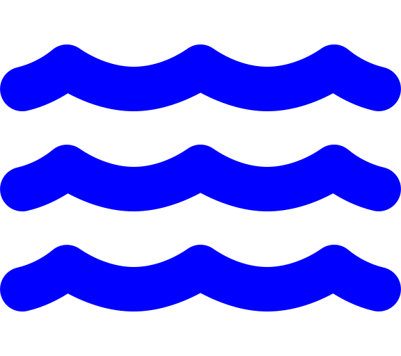
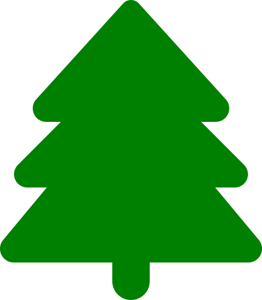
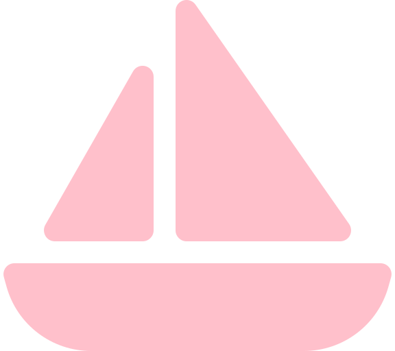

# ASOC UON

## 📚 Table of Contents
- [Overview](#overview)
- [Viewing Maps](#viewing-maps) 
  - [Example Maps](#example-maps)
  - [How To Use Maps](#how-to-use)
- [Features](#features)
- [Requirements](#requirements)
- [Setup](#setup)
  - [Install Required Libraries](#install-required-libraries)
  - [Folder Structure](#folder-structure)
  - [Icon Colors and Symbols](#icon-colors-and-symbols)
- [Running Code](#running-code)
- [Usage](#usage)
  - [Clone the Repository](#clone-the-repository)
  - [Run the Script](#run-the-script)
  - [View the Map](#view-the-map)
- [Google Sheet Structure](#google-sheet-structure)
  - [Example Google Sheet](#example-google-sheet)
- [Notes](#notes)
- [License](#license)
- [Acknowledgments](#cknowledgments)

## Overview
This project provides Python scripts to create interactive HTML maps, which can be viewed in any web browser.
Specifically, maps are created for ASOC church locations/routes, Sabbath walks and letterboxing.

(<a href="#readme-top">back to top</a>)

## Viewing Maps
The maps can be viewed through GitHub Pages. You can access them using the following link format:
https://roryyarr.github.io/ASOC-Walks/`file-name`.html

Replace `file-name` with the specific file you want to view. 
Note: replace spaces(" ") with "%20". 

### Example Maps

Here are some example usages of the maps:

1. **Main ASOC Walk Locations Map**:
   - **Description**: This map shows the main locations for the ASOC walks.
   - **Link**: https://nuac-av.github.io/ASOC-UON/Maps/Misc/ASOC_walk_locations_map.html

2. **Mount Sugarloaf Map**:
   - **Description**: This map highlights the route for the mount Sugarloaf walk.
   - **Link**:  https://nuac-av.github.io/ASOC-UON/Maps/Sabbath_Walks/Mount%20Sugarloaf/Sugarloaf_Walk.html

### How To Use Maps

1. **Accessing the Map**:
   - Open your web browser.
   - Type the URL or click on the provided link for the specific map you want to view.

2. **Interacting with the Map**:
   - *Zoom In/Out*: Use the zoom controls to focus on specific areas.
   - *Pan*: Click and drag to move around the map.
   - *Markers*: Click on markers to get more information about each location.
   - *Filter*: Click on layer symbol in top right corner, allowing you to toggle on or off the different coloured icons.

(<a href="#readme-top">back to top</a>)

## Features
- Creates Interactive Sabbath Walk Maps:
  - Using the following sheet as a backend: [Google Sheets Document](https://docs.google.com/spreadsheets/d/1mGR_xugxcg3Pc3e1KLzggZn6XfnSJOuHncZ64hOo8M4/edit?fbclid=IwZXh0bgNhZW0CMTAAAR3rcnaz2qedGxf1LaI0fz7X7gUQiZrvZTjs3x-MfPTNZODKO8ykz3piWDI_aem_mtzQRofiQxsPinF7C6uSHg&gid=0#gid=0)
  - Reads data from the google sheets.
  - Plots 
- Create an interactive map from the database
- Add markers for each location with popups containing relevant information
- Save the map as an HTML file
- Add GPX routes from a folder and group them on the same level as regions in the tree structure

(<a href="#readme-top">back to top</a>)

## Requirements
- Python 3.x
- `pandas` library
- `geopandas` libary
- `folium` library
- `gpxpy` library
- `pdf2image` library
- `Pillow` library
- `OSMINX` library
- `shapely` library

(<a href="#readme-top">back to top</a>)

<!-- Setup -->
## Setup

This project uses a google sheet google sheet for storing church, caregroup and walk locations.

### Google Sheet Structure
- **Name**: The name of the location.
- **Latitude**: The latitude of the location.
- **Longitude**: The longitude of the location.
- **Google_Link**: A Google Maps link or other relevant URL.
- **Address**: The address of the location.
- **Description**: A description of the location or any additional notes.
- **Route_Link**: A link to the route map for that location.
- **Icon**: The icon to use for the marker.
- **Colour**: The colour of the marker.

(<a href="#readme-top">back to top</a>)

### Example Google Sheet
| Location | Latitude | Longitude | Google_Link | Address | Discription | Route_Link  | Icon | Color |
| :----: | :----: | :----: | :----: | :----: | :----: | :----: | :----: | :----: |
|Awabakal Nature Reserve  | -32.99149503 | 151.7222826  | [Link](https://www.google.com/maps/place/13+Ivy+St,+Dudley+NSW+2290/data=!4m6!3m5!1s0x6b7317ca43cdc65d:0x6eedd6577b803386!7e2!8m2!3d-32.9917425!4d151.7222826?utm_source=mstt_1&entry=gps&lucs=,47075915&g_ep=CAESCjExLjEwOS4xMDEYACDXggMqCSw0NzA3NTkxNUICQVU%3D)   | 13 Ivy St, Dudley NSW 2290      | It will be in the bush, so please have proper walking shoes for the walk. We can park on the road around Ivy Street. | [link](file:///Users/roryyarr/Desktop/ASOC%20Walks/Maps/ASOC_walk_locations_map.html) | tree  | green |
| Bar Beach  | -32.94047053 | 151.7695674  | [Link](https://www.google.com/maps/place/Yuelarbah+Track,+Bar+Beach+NSW+2300/@-32.9406461,151.764718,946m/data=!3m2!1e3!4b1!4m15!1m8!3m7!1s0x6b73143fbd4c9111:0x5017d681632e890!2sBar+Beach+NSW+2300!3b1!8m2!3d-32.9377866!4d151.7701917!16s%2Fm%2F02x66br!3m5!1s0x6b73143e338a20c5:0xbac9ffd0659c571a!8m2!3d-32.9406507!4d151.7695889!16s%2Fg%2F11m_lcwt1h?entry=ttu) | Yuelarbah Track, Bar Beach NSW 2300 |  |  | umbrella-beach | beige |
| ⋮  | ⋮ | ⋮ | ⋮ | ⋮ | ⋮ | ⋮  | ⋮  |

### Map Icon Symbols

| Icon Symbol                                      | Icon Name        | Colour                                           | Description                                       |
|:------------------------------------------------:|:----------------:|:------------------------------------------------:|:-------------------------------------------------:|
|                    | `water`          | blue             | Used for rivers and lakes (excluding saltwater).  |
|          | `plant-wilt`     | lightgreen | Used for wetlands.                                |
|                      | `tree`           | green           | Used for forests and parks.                       |
|  | `umbrella-beach` | beige           | For beaches and other sandy environments.         |
|              | `mountain`       | darkgreen   | For hilly and mountainous walks.                  |
|              | `sailboat`       | pink             | For boat ramps.                                   |
| ,  | `Ferry` and `Ship` | black | Used for other harbour/coastal walks.         |
|                      | `flag`           | red               | Other walks not listed.                           |

### Folder Structure
- **GPX_Files**: Contains all GPX files
  - *[Church_Locations](GPX_Files/Church_Locations)*: Contains GPX file for Church Locations.
  - *[Letterbox_Routes](GPX_Files/Letterbox_Routes)*: Contains GPX files of completed Letterbox routes.
  - *[Sabbath_Walks](GPX_Files/Sabbath_Walks)*: Contains GPX files for Sabbath walks.
  - *[GPX_Studio.md](GPX_Files/GPX_Studio.md)*: Details how to produce GPX file using GPX Studio.
- **Icons**: Contains Icon SVG files for README.
- **Map_Generating_Codes**: Contains the code for generating maps.
  - *[Create_Routes](Map_Generating_Codes/Create_Routes)*: Creates a route.
  - *[Letterbox](Map_Generating_Codes/Letterbox)*: Creates the letterbox maps.
  - *[Misc](Map_Generating_Codes/Misc)*
  - *[Route_Code](Map_Generating_Codes/Route_Code)*
  - *[README.md](Map_Generating_Codes/README.md)*
  - *[Update_Walks.py](Map_Generating_Codes/Update_Walks.py)*: Updates the map of ASOC walks
- **Maps**: Contains the HTML files for the maps.
  - *[Church_Locations](Maps/Church_Locations)*: Contains maps for church and caregroup locations.
  - *[Letterbox](Maps/Letterbox)*: Contains maps used for letterboxing.
  - *[Misc](Maps/Misc)*: Other maps.
  - *[Sabbath_Walks](Maps/Sabbath_Walks)*: Contains maps for Sabbath walks.
- **Pictures**: Contains all pictures except SVGs.
- **ASOC_Walks.ipynb**: Jupyter notebook for code testing.
- **README.md**: Explains the project.

Fix later
- **Map_Python_Codes**: Contains Python files for mapping.
  - *`Update_Walks_file.py`*: Updates the ASOC_walk_locations_map.html file with the current Google Sheets data.
  - *`Create_Routes_map.py`*: Creates a map for a route.
  - *`Create_Route_UI.py`*: Script for creating routes with a user interface.

  
(<a href="#readme-top">back to top</a>)

### Icon Colors and Symbols
The available colors for icons are: `black`, `beige`, `lightblue`, `gray`, `blue`, `darkred`, `lightgreen`, `purple`, `red`, `green`, `lightred`, `white`, `darkblue`, `darkpurple`, `cadetblue`, `orange`, `pink`, `lightgray`, `darkgreen`.

More details can be found [here](https://www.kaggle.com/code/aungdev/colors-available-for-marker-icons-in-folium).

Icons can be chosen from [Font Awesome](https://fontawesome.com/search?o=r&m=free). Additionally, PNG files can be used as icons.

(<a href="#readme-top">back to top</a>)

### Install Required Libraries
Make sure you have the required libraries installed. You can install these libraries using `pip`:
- pip install folium
- pip install pandas
- pip install gpxpy
- pip install pdf2image pillow

(<a href="#readme-top">back to top</a>)

## Usage

`shh
clone the repo, then exacute the following codes.

### Updating Sabbath Walks map

1. Pull latest GitHub repo.
2. Ensure the google sheets is correctly formated.
3. Run the Update_Walks.py file
4. Commit changes
5. push changes to the remote repo.

### Creating Route map

1. 
2. 
3. 

### Updating Letterbox Map
 
 1. Pull latest
 2. Add all gpx files to GPX_Files/Letterbox_Routes folder.
 3. Run Update_Letterbox_Map.py file.
 3. Track gpx files: 
 4. Commit changes: commit -m "A

<!-- ROADMAP -->
## Roadmap

- [x] Add Changelog
- [x] Add back to top links
- [ ] Add route maps for all walks

(<a href="#readme-top">back to top</a>)

## Contributing to the Maps

If you would like to contribute to the maps, follow these steps:

1. Fork the Project
2. Create your Feature Branch (`git checkout -b feature/name-of-changes`)
3. Commit your Changes (`git commit -m 'Add name-of-changes'`)
4. Push to the Branch (`git push origin feature/name-of-changes`)
5. Open a Pull Request

(<a href="#readme-top">back to top</a>)

## License
Distributed under the MIT License. See `LICENSE` for more information.

(<a href="#readme-top">back to top</a>)

## Contact
`Rory Yarr`
- **Email**: roryyarrcoder@gmail.com
- **LinkedIn**: https://www.linkedin.com/in/rory-yarr-3a5833211/

(<a href="#readme-top">back to top</a>)

## Acknowledgments
- **OSMnx**: Boeing, G. 2017. "OSMnx: New Methods for Acquiring, Constructing, Analyzing, and Visualizing Complex Street Networks." Computers, Environment and Urban Systems, 65, 126-139. https://doi.org/10.1016/j.compenvurbsys.2017.05.004

